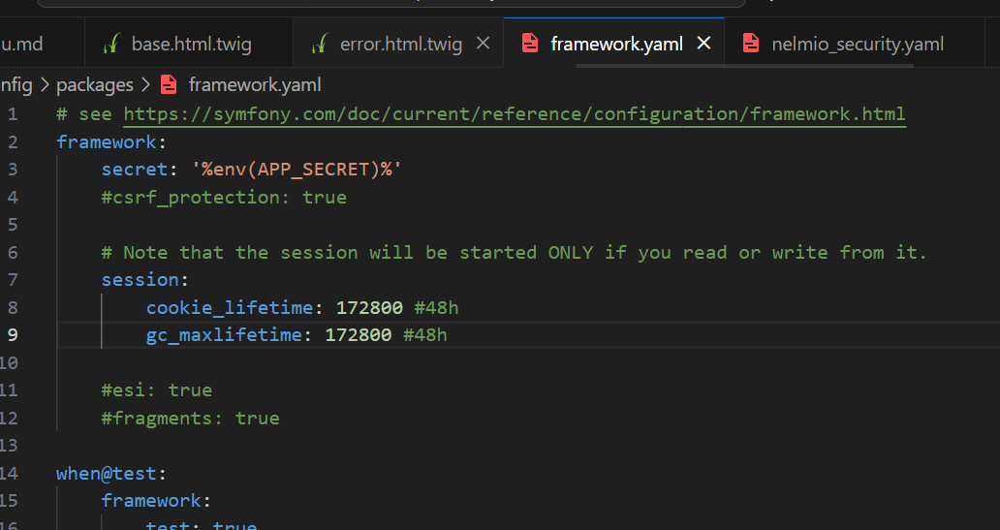
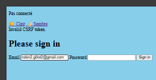
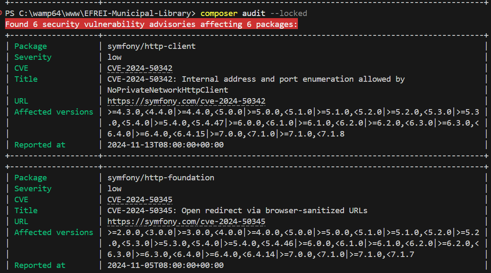

# Sécurisation de l’application *« Bibliothèque »*
## Authentification 48h

## Protection CSRF

## Vulnérabilités des dépendances

## Difficultés rencontrées et solutions
Il ma été impossible malgré plusieurs essais de gérer la gestion des authorisations, je voulais faire en sorte qu'un utilisateur non connecter n'ai accès qu'a certaines routes (/login pour se connecter et /user/new pour créer son compte) mais cela n'a pas marcher, dans la partie access control de security.yaml , les modifications sont donc en commentaires
## Bilan des acquis
- Compréhension plus profonde du framework symfony bien que celui-ci soit encore assez obscur tant il parait complet (presque trop)
- meilleure compréhension surtout des csp , tokens csrf et de l'authentification utilisateur.